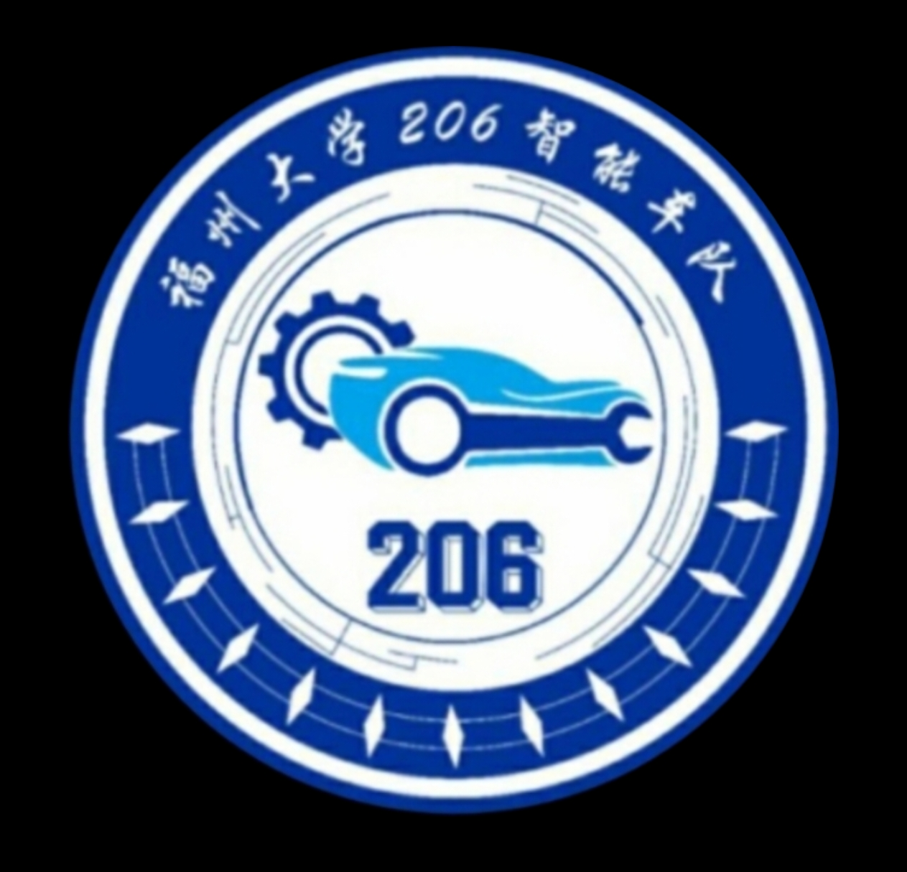

  

<h1 align="center">2026年福州大学206智能车队纳新</h1>

福州大学206智能车队主要面向**全国大学生智能汽车竞赛**与**全国大学生电子设计竞赛**，围绕嵌入式开发、电子硬件、机器视觉和整车系统开展训练与竞赛实践。

实验室提供系统培训、学习资料、设备场地、学长学姐答疑和竞赛经费支持。优秀竞赛项目还可按规定申报 SRTP 等大学生科研训练项目。

## 在206，你会真正动手

你会从 C 语言、单片机和基础电路入门，逐步参与：

- 编写底层驱动、控制算法与上位机程序；
- 设计原理图和 PCB，完成焊接、接线与硬件调试；
- 采集数据、训练视觉模型并部署到嵌入式平台；
- 完成循迹、避障、环岛等赛道任务与整车联调。

在这里，你不是旁观者。写下的每一行代码、焊上的每一个器件，最终都要在真实系统和赛道上接受检验。你也会遇到一群愿意一起排查故障、改进方案、参加智能车、电赛、中国机器人大赛等赛事的队友。

## 近年来部分成绩

### 2026年

- 全国大学生智能汽车竞赛全国总决赛：人工智能模型组二等奖、人工智能视觉组二等奖；
- 全国大学生电子设计竞赛：H 题福建省一等奖两项；
- 海峡赛：竞速组一等奖一项；
- 福州大学 SRTP：国家级立项一项，省级与校级立项若干。

### 2025年

- 全国大学生智能汽车竞赛全国总决赛：一等奖一项、二等奖一项；
- 华南赛：一等奖两项、二等奖三项、三等奖两项，另获省级奖项若干；
- 福州大学 SRTP：国家级立项三项，省级与校级立项若干。

### 2024年

- 全国大学生智能汽车竞赛全国总决赛：二等奖一项；
- 华南赛：一等奖一项、二等奖三项、三等奖两项，另获省级奖项若干。

> 赛事类别认定、综合测评及推免加分政策，以福州大学当年发布的正式文件为准。
